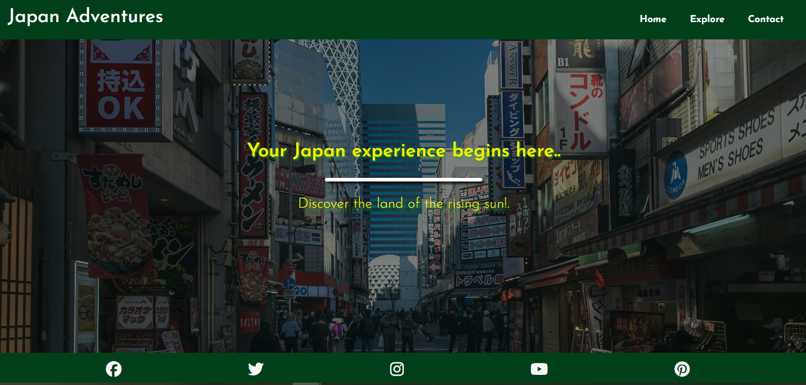

# Japan Adventures

Japan Adventures is a website which solely focuses on three main dynamics of Japan that inclues, its Cultural Richness, Tech & Innovation and Food Diversity.

The objective of this website is to enhance the interest of a user to see particular aspects of Japan with the inclusion of high quality images, intuitive layout and insightful text.

The site is aimed for those who are willing to travel and explore Japan and understand the importance of its core values as a country.

## UX

The site has core features that allow users to find out information about Japan in more depth and a carefully chosen color scheme to help UX.

## User Stories

- As a **user** I would like **to see high quality pictures of Japan** so I can **experience how specific some areas look**
- As a **user** I would like **to see the dynamism of visiting Japan** so I can **understand its Cultural richness, Tech and Food diversity**
- As a **user** I would like **to see a nice menu nav header** so I can **navigate to whichever page I want without any issues**
- As a **site owner** I want  **users to easily navigate the site** so that **they can find out more info about why they should visit Japan**

## High-Level Features

| **Home page** | **Explore** | **Contact** |  **Overview of Website**  | 
|---|---|---|---|
| Home Gallery  | Japan Adventures  | Form  |  Navbar  |
| connects user to more insights | Explorations in Japan | Mail list checkbox  | Social Media links |
| Explorations  |  Top quality images of Japanese Culture, Tech and Food Diversity | Meaningful alt text |

|  **Features**  |  **Value**  | **Effort**  |
|---|---|---|
| Homepage  |  High  | Medium  |
| Explore Page  | High |  Medium  |
| Contact Page  | Medium | Low  |
| Navbar  | High | Low |
| Social Media  | High | Low |
| Reviews | Medium | Low |

| Feature  |  Priority  |
|---|---|
| Homepage | 3 |
| Explore  | 5 |
| Contact  | 4 |
| Navbar  | 2 |
| Social Links  | 4 |
| Reviews  | 5 |

- __Navigation Bar__

  -
  -

- __The landing page image__

  - The landing page image exhibits the overal summary of different reasons a user might want to visit.

  - It offers the brand name and ambience with a brief explantion of value.

- __Japan Adventure Section__

  - The section brings the user to a more in depth explanation of the Japanese culture richness, tech and innovation and food diversity.
  - On desktop, hovering over the images in this section creates an interactiver overlay with a link to appear, the link in the overlay directs to the relevant section of the explore page.

- __The Contact Section__

  - This section main requires users to be in contact as feedback including name email and message text fields and a submit button beneath.
  - There is also a vote for your favourite place with a list of Japanese places listed with a checkbox and a submit button below.
  - There is also a section for user to select their favourite food to choose out of 5 options with also another submit button below.

  

    - The footer includes links for user to follow and they also contain a hover effect.
    - The footer is consisitently displayed accross all the pages on the website.

  ## Structure

  ### Site Wireframes

  - __Home Page__

  

-__Explore Page__

-__Contact Page__

-__Home Page Mobile View__

-__Explore Page Mobile View__

-__Contact Page Mobile View__

## Surface

### Design

#### Selected Colors

A site palette was chose to showcase a color scheme that is both suitable and appropriate for the ambience of the country of Japan.

The palette was created using http://colormind.io/

The chose colors are:

### fonts

Josefin Sans, sans-serif was used for both Headings and text.

### Media

Images are utilised to promote UX throughout the website.

Home page - The hero image showcases the overal look of being in Japan, Tokyo while promoting visual interest for users.

Explore Page - Images of each sub category of Japan's Cultural richness, Tech and Food diversity are included together with informative text to allow the user to understand the overview of these Japanaese components, together with a nice UX design.

Contact Page - 

## Technologies Utilised

- HTML

- CSS3

## Testing

Japan Adventures has been tested on Safari, Opera, Chrome and Microsoft Edge

Japan Adventures has been vigorously tested throughout the developmment process for responsiveness across various devices curtesy of the chrome developer tools

### Validating

- HTML

  - [HTML Validation](https://validator.w3.org/)

  

- CSS

  -[CSS Validation](https://jigsaw.w3.org/css-validator/)

  

- Lighthouse tools were also utilised to test the website.

Desktop :

Mobile View:

## User Story Testing

1. As a **USER** I want to see the **dynamism of visiting Japan** so that **I understand its Cultural Richness, Tech and Innovation & its Food Diversity**.

- The website contins all the relevant information layed out in a way that a user can get an Idea of different aspects of why visit Japan.

2.

3.

4.

5.

6.

7.

8.

9.

10.

### Features For Future Implementation

## Known Issues and Bugs

## Deployment

### Credits

### Content

### Media

All images were taken from [Unsplash](https://unsplash.com/)

## Acknowledgements

### Team Classy Coders

Terence Zengeya
Jack Hunt
Odell White